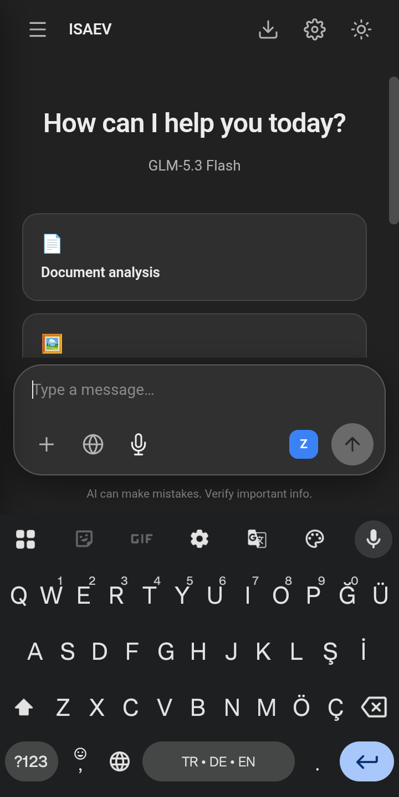
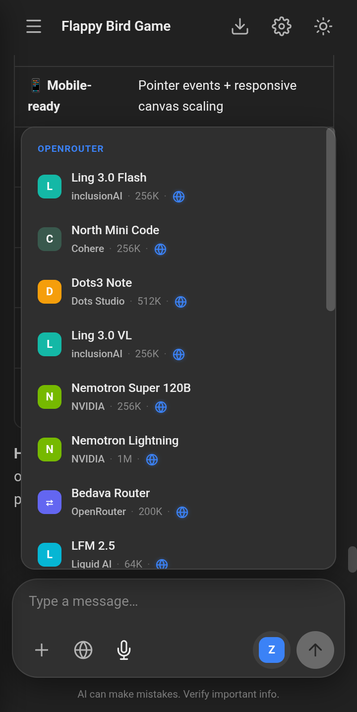
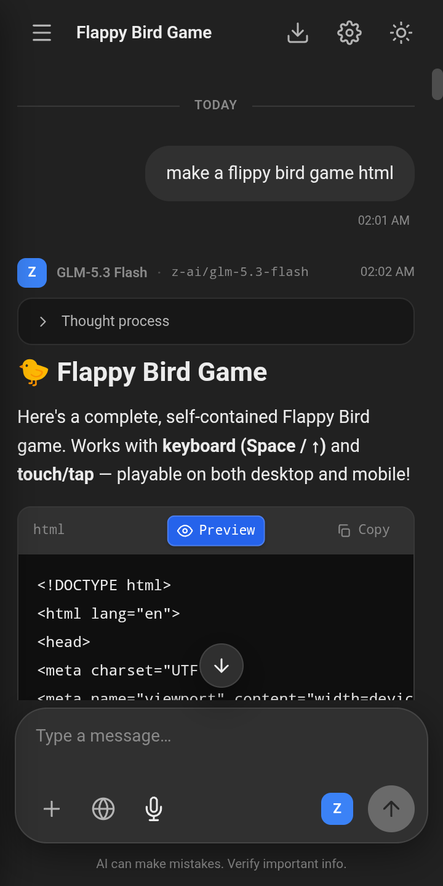
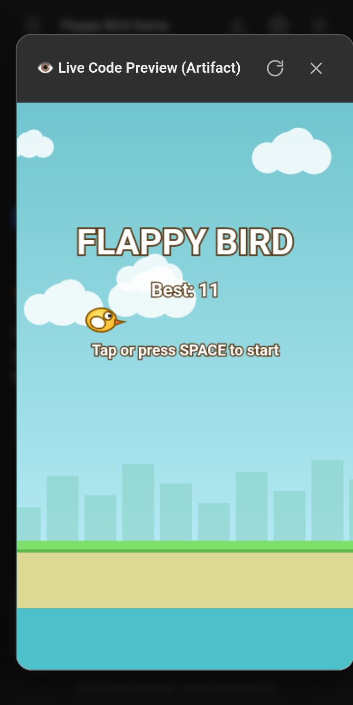
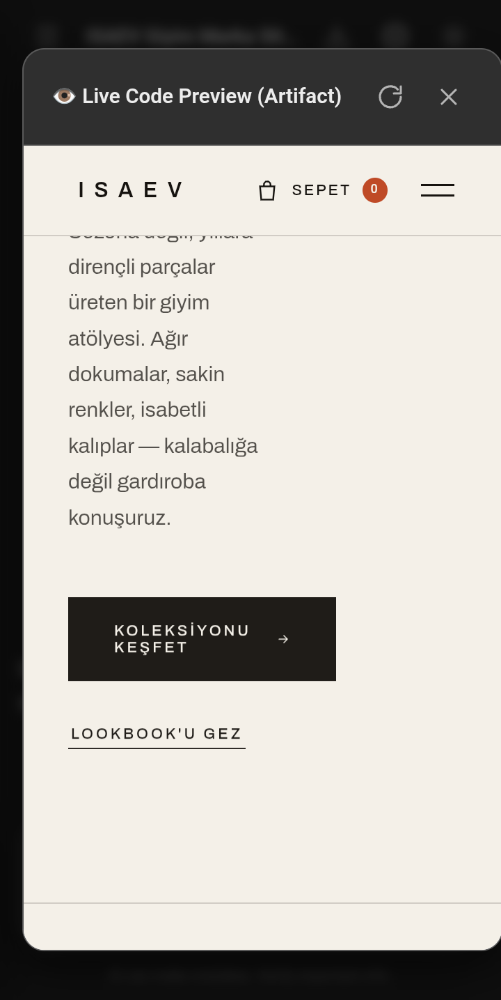
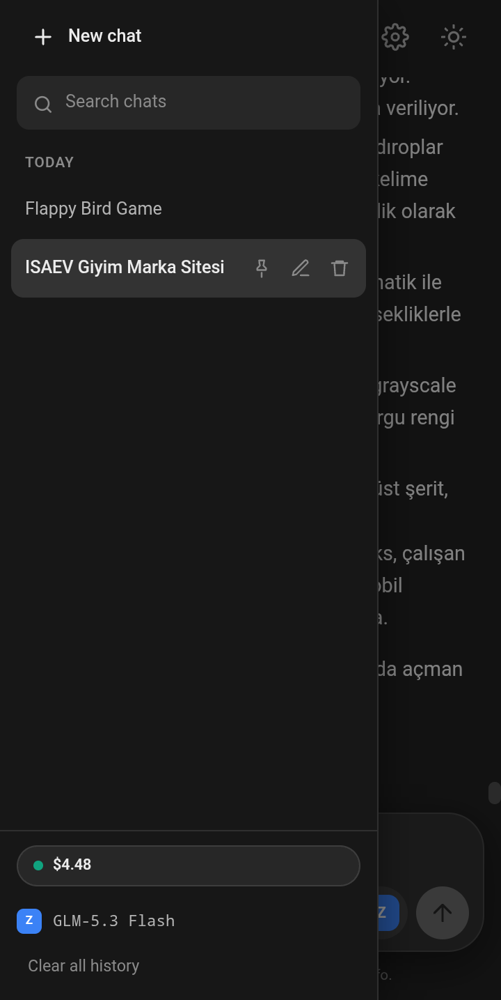
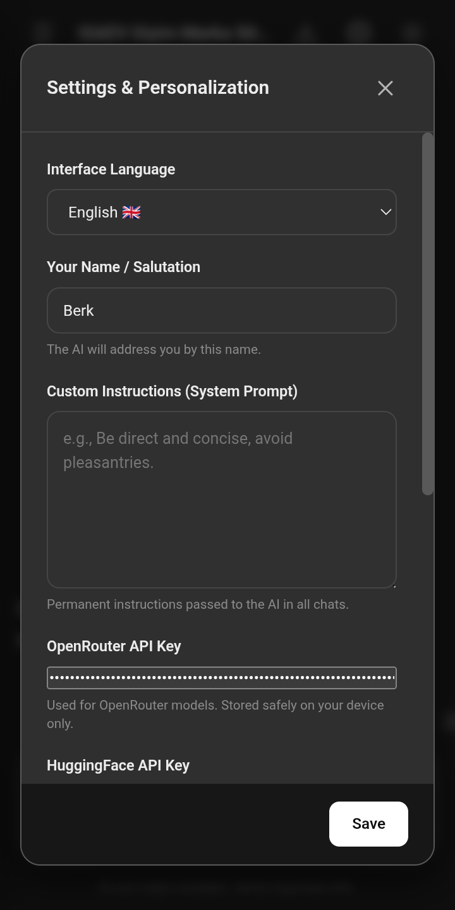
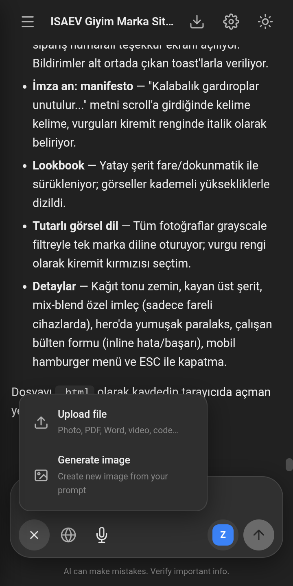

# ISAEV — Web ve Android İçin Bağımsız, Gizlilik Odaklı Yapay Zeka İstemcisi

ISAEV; **OpenRouter** ve **Hugging Face** üzerindeki modern büyük dil modelleriyle doğrudan iletişim kurmak üzere tasarlanmış, aracı sunucu ve telemetri içermeyen bağımsız bir yapay zeka arayüzüdür. Yerel öncelikli (local-first) mimariyle geliştirilmiştir; kullanıcı verilerini, sohbet geçmişini ve API anahtarlarını harici üçüncü taraf sunuculara aktarmaz.

Masaüstünde SQLite veritabanı ile çalışan hafif bir Node.js yerel sunucusu olarak görev yapar. Android tarafında ise **arka uç sunucusuna ihtiyaç duymayan**, tamamen bağımsız bir APK olarak derlenir. Telefonunuzun içinde çalışan istemci motoru (`local-backend.js` + IndexedDB), telefonunuzu doğrudan yapay zeka sağlayıcılarına bağlar; evinizdeki bilgisayarı açık bırakmanız gerekmez.

[🇬🇧 Click for English Documentation](../README.md)

---

## Ekran Görüntüleri Galerisi

Aşağıdaki ekran görüntüleri, uygulamanın Android cihaz üzerindeki bağımsız sürümünden doğrudan alınmıştır.

| 1. Sade Başlangıç Ekranı | 2. Gruplandırılmış Model Seçici |
|:---:|:---:|
|  |  |
| *ISAEV kimliği, hazır yönlendirme şablonları ve aktif model göstergesi.* | *Sağlayıcı ve üreticiye göre gruplanmış, bağlam sınırı ve web desteği göstergeli liste.* |

| 3. Kod Üretimi ve Önizleme Eylemi | 4. Canlı Kod Önizleme (Artifact) |
|:---:|:---:|
|  |  |
| *Düşünce süreci, maliyet sayacı ve ortalanmış Canlı Önizleme butonu.* | *İzole sandbox penceresi içinde çalışan etkileşimli, dokunmatik uyumlu Flappy Bird oyunu.* |

| 5. Duyarlı Web Uygulaması Önizlemesi | 6. Kenar Çubuğu ve Sohbet Geçmişi |
|:---:|:---:|
|  |  |
| *Kaydırma, menü açma ve dokunmatik eylemleri tam destekleyen lüks marka web sitesi.* | *Kronolojik sohbet geçmişi, aktif model göstergesi ve OpenRouter bakiye hapı.* |

| 7. Ayarlar ve BYOK Mimarisi | 8. Besteci ve Çok Modlu Girdi Araçları |
|:---:|:---:|
|  |  |
| *Kendi anahtarını getir (BYOK), dil seçimi, kişisel talimatlar ve JSON yedekleme.* | *Açılır araç menüsü (+), dosya ekleme, canlı web arama ve mikrofonla sesli giriş.* |

---

## Öne Çıkan Yetenekler

### 1. Çift Çalışma Ortamı Mimarisi
- **Masaüstü Web**: Hızlı Node.js + Express arka ucu, SQLite veritabanı (`data/chat.db`) ve yerel dosya önbelleği.
- **Android Bağımsız Motor**: Android WebView içerisinde tamamen otonom çalışır. `/api/*` uç noktalarını tarayıcı içinde `local-backend.js` ile karşılar; sohbetleri ve ekleri IndexedDB üzerinde saklar.

### 2. Kendi Anahtarını Getir (BYOK) ve Sıfır Telemetri
- İzleme, telemetri veya aracı analiz sunucuları kesinlikle bulunmaz.
- Masaüstü için API anahtarlarınızı `.env` dosyasında tutabilir veya doğrudan uygulamanın **Ayarlar** penceresinden (`localStorage`) girebilirsiniz.
- Çoklu anahtar rotasyonu: OpenRouter için virgülle ayrılmış birden fazla anahtar tanımlanabilir. Hız sınırı (`429`), yetkilendirme (`401`) veya bakiye tükenmesi (`402`) durumunda sıradaki anahtara otomatik geçilir.

### 3. Canlı Kod Önizleme (Artifacts Sandbox)
- Tek dosya HTML/CSS/JavaScript uygulamalarını ve oyunlarını izole bir sandbox ortamında anında çalıştırır.
- Üretilen kodun üzerindeki mavi **Önizleme** butonuna basarak uygulamayı doğrudan test edebilirsiniz.
- Dokunmatik ekran normalizasyonu sayesinde üretilen web uygulamaları ve oyunlar hem mobil dokunmatik ekranda hem de masaüstü klavyesiyle pürüzsüz çalışır.

### 4. Gruplandırılmış Model Seçimi ve Web Arama Desteği
- **OpenRouter** ve **Hugging Face Router** modellerini tek bir çatıda birleştirir.
- Üreticiye göre düzenlenmiş, token bağlam sınırlarını (ör. 256K, 512K, 1M) gösteren temiz seçim sayfası.
- Seçilen modelin canlı web aramasını destekleyip desteklemediğini gösteren renkli rozetler.

### 5. Çok Dilli Arayüz ve Otomatik Yanıt Dili Eşleme
- 4 dil desteği: **Türkçe**, **İngilizce**, **Rusça** ve **Almanca**.
- Akıllı sistem istemi kuralı: Kullanıcı hangi dilde soru sorarsa, model otomatik olarak o dilde yanıt verir.

### 6. Çok Modlu Araçlar
- **Belge ve Görsel Analizi**: Resim, PDF, metin ve Word (`.docx`) belgelerini yükleme ve analiz etme.
- **Canlı Web Arama**: Gerçek zamanlı internet araması ile yanıtları güncelleme.
- **Sesle Yazma (STT)**: Tarayıcının ve Android'in yerel ses tanıma servislerini kullanarak mikrofonla doğrudan metin yazdırma.
- **Veri Taşınabilirliği**: Tüm veritabanını tek tıkla JSON olarak dışa aktarma ve geri yükleme.

---

## Mimari Karşılaştırma

| Boyut | Masaüstü Web Sürümü | Android Bağımsız APK |
|---|---|---|
| **Arka Uç Motoru** | Node.js + Express | `local-backend.js` (WebView içi Fetch Yakalayıcı) |
| **Veritabanı** | SQLite (`data/chat.db`) | Tarayıcı IndexedDB (`oxalpha`) |
| **Dosya Saklama** | Yerel Disk (`data/uploads`) | IndexedDB Blob / Blob URL |
| **API İletişimi** | Sunucu → Sağlayıcı API | Cihaz → Sağlayıcı API (Doğrudan HTTPS) |
| **Gereksinimler** | Node.js 18+ | Yok (Doğrudan kurulan APK) |
| **Çalışma Aralığı** | Tüm modern masaüstü tarayıcılar | Android 7.0+ (API Seviyesi 24+) |

---

## Masaüstü Kurulumu

### Gereksinimler
- Node.js (v18.0.0 veya üzeri)
- npm

### Adımlar

1. Depoyu klonlayın:
   ```bash
   git clone https://github.com/swartz13/self-ai-chat-app-isaev.git
   cd self-ai-chat-app-isaev
   ```

2. Bağımlılıkları yükleyin:
   ```bash
   npm install
   ```

3. Çevre değişkenlerini oluşturun:
   ```bash
   cp .env.example .env
   ```
   `.env` dosyasını açıp API anahtarlarınızı girin:
   ```env
   OPENROUTER_API_KEYS=sk-or-v1-anahtariniz-buraya
   HF_API_KEY=hf_huggingface-anahtariniz-buraya
   PORT=3000
   ```
   *(Not: `.env` dosyasını boş bırakıp anahtarları doğrudan arayüzdeki Ayarlar penceresinden de girebilirsiniz).*

4. Sunucuyu başlatın:
   ```bash
   npm start
   ```
   Tarayıcınızda [http://localhost:3000](http://localhost:3000) adresine gidin.

---

## Android Bağımsız Uygulaması

Android sürümü bilgisayarınızda **sunucu açık olmasını gerektirmez**. Telefonunuz doğrudan OpenRouter ve Hugging Face servisleriyle konuşur.

### Yöntem 1: Hazır APK'yı Yükleme
1. GitHub Releases bölümünden en güncel `OxAlpha.apk` dosyasını indirin.
2. Dosyayı telefonunuza aktarın veya doğrudan telefondan indirin.
3. Dosya yöneticisinden APK dosyasına dokunun ve bilinmeyen kaynaklardan yüklemeye izin verin.
4. Uygulamayı açın, sağ üstteki **Ayarlar** (çark) simgesine tıklayarak OpenRouter veya Hugging Face anahtarınızı yapıştırın.

### Yöntem 2: USB Üzerinden Tek Komutla Kurulum (ADB)
Sideload kısıtlaması olan üretici arayüzlerinde (ColorOS, MIUI vb.) en güvenilir yoldur:
1. Telefonda Geliştirici Seçeneklerini açın:
   - **Ayarlar > Telefon Hakkında > Sürüm** yolunu izleyin.
   - **Derleme Numarası** üzerine 7 kez dokunun.
2. **Geliştirici Seçenekleri** altından **USB Hata Ayıklama** ve **USB Üzerinden Yükleme** seçeneklerini aktif edin.
3. Telefonu kabloyla bilgisayara bağlayın ve ekranda çıkan onay kutusunu işaretleyin.
4. Kurulum betiğini çalıştırın:
   ```bash
   export ANDROID_HOME=/path/to/android-sdk
   bash android/install-usb.sh
   ```

### Yöntem 3: Kaynak Koddan 3 Saniyede APK Derleme (Gradle Olmadan)
Bu proje, Gradle hantallığını tamamen ortadan kaldıran ve doğrudan Android SDK araçlarını (`aapt2`, `javac`, `d8`, `zipalign`, `apksigner`) kullanan özel bir derleme betiğine sahiptir:

```bash
export ANDROID_HOME=/data/android-sdk  # SDK yolunuzu belirtin
bash android/build.sh
```

- **Çıktı**: Kök dizinde `OxAlpha.apk` üretilir.
- **Hız**: Ortalama 2-3 saniye sürer.
- **İmza**: Mevcut değilse otomatik olarak yerel anahtar deposu (`android/oxalpha.keystore`) üretilip APK imzalanır.

---

## Güvenlik ve Gizlilik Taahhüdü

- **Yerel Veri Saklama**: Sohbetler, ayarlar ve ekler sadece kendi cihazınızda tutulur (masaüstünde SQLite, mobilde IndexedDB).
- **Aracısız Bağlantı**: İstekleriniz şifreli HTTPS bağlantısı üzerinden doğrudan OpenRouter veya Hugging Face sunucularına gider; araya hiçbir üçüncü taraf sunucu girmez.
- **Sıfır Sızıntı**: Depo içerisinde hiçbir gizli API anahtarı, kişisel IP adresi veya özel kimlik bilgisi bulunmaz. Tüm anahtarlar kullanıcının kendi kontrolündedir.

---

## Lisans

Bu proje [ISC Lisansı](LICENSE) kapsamında açık kaynaklı olarak sunulmaktadır.
